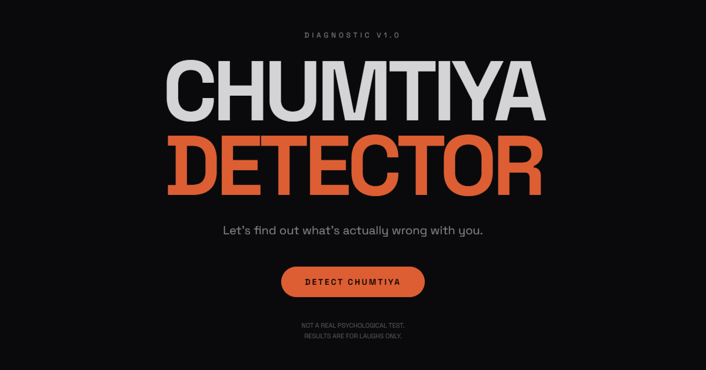

<div align="center">

# 🎯 CHUMTIYA DETECTOR

**The Ultimate High-Precision Psychological Parody & Dost Diagnostic Engine**

[](https://chumtiya-detector.vercel.app/)
[](https://react.dev/)
[](https://tanstack.com/start)
[](https://www.typescriptlang.org/)
[](https://tailwindcss.com/)
[](LICENSE)

<br />

<p align="center">
  
</p>

### *"Let's find out what's actually wrong with you (or your friends)."*

[🚀 **Launch Diagnostic Engine**](https://chumtiya-detector.vercel.app/) • [👥 **Diagnose a Friend**](https://chumtiya-detector.vercel.app/friend) • [📜 **Hackathon Certificates**](https://chumtiya-detector.vercel.app/)

---

</div>

## 📌 Overview

**Chumtiya Detector** is an irreverent, razor-sharp psychological parody web app built to scientifically identify intellectual superiority complexes, chronic cynicism, social delusions, and certified chumtiyagiri.

Whether you're taking the self-diagnostic test, putting a friend on trial through the **Diagnose a Friend** Hinglish quiz, or issuing a downloadable **Chumtiya Hackathon Contest Certificate**, this platform delivers brutal humor wrapped in a slick, dark-mode terminal aesthetic.

---

## ✨ Features

### 1. 🧠 Core 16-Question Diagnostic Engine
- Smooth screen-by-screen progression with keyboard shortcuts and tactile option selectors.
- Dynamic scoring algorithm evaluating superiority complexes, social intolerance, and cynicism.
- **6 Precision Classification Tiers**:
  - `0% - 20%`: Surprisingly Normal
  - `21% - 40%`: Slightly Sus
  - `41% - 60%`: Certified Chumtiya
  - `61% - 80%`: Advanced Chumtiya
  - `81% - 95%`: Premium Chumtiya
  - `96% - 100%`: Final Boss Chumtiya
- Dynamic psychological traits (e.g. *Intellectual Superiority Complex*, *People Are Annoying™*, *Main Character Syndrome*).

### 2. 👥 Diagnose a Friend (Hinglish Roast Edition)
- Custom survey calibrated specifically for Indian friend circles and college room-mates.
- Enter your friend's name and analyze real scenarios:
  - *Kya Instagram par 10 Bolero ki photo daal ke Haryanvi gaane lagata hai?*
  - *Sala aapke paise ka khaa kar aapko hi ginata hai?*
  - *Public area me bina kisi sharm ke janwaro jaisa vyavahar karta hai?*
  - *Ladkiyo ke samne fake nonchalant banne ki koshish me cartoon lagta hai?*
- Dedicated back navigation at every step so you never lose control.

### 3. 📜 Official Chumtiya Hackathon Contest Certificate
- High-resolution **1400 × 980** Canvas 2D generated certificates.
- Designed to replicate authentic, high-stakes national hackathon credentials with:
  - Official Golden Badge & Guilloché Borders
  - Unique Hash Verification Serial ID
  - Dynamic Candidate Classification & Primary Trait Endorsement
  - One-click instant high-quality PNG download.

### 4. 📢 Official Public Decree Certificate for Friends
- Specially issued public proclamation signed by the sender.
- Certifies that the recipient has been legally tried, diagnosed, and classified before the public council.

### 5. ⚔️ 1v1 Dost vs Dost Roast Battle
- Challenge your friends via dynamic URL links (`/vs/$opponentId`).
- Compare diagnostic scores side-by-side to crown the true champion.

### 6. 🔊 Synthesized Web Audio Sound Engine
- Zero external audio files — procedural 8-bit sound effects generated on-the-fly using the Web Audio API.
- Global floating sound toggle with persistent mute preferences.

### 7. 🖼️ SSR Open Graph & Social Cards
- Server-side rendered Open Graph meta tags and Twitter preview cards.
- Beautiful, high-converting link previews when shared on WhatsApp, Telegram, Discord, and Twitter/X.

### 8. 🎮 The Detector Arcade (Specialized Roast Tests)
- 🚩 **Red Flag Detector** (`/test/red-flag`): 10 questions on dry texting, Cister counts, victim cards, and situationship rizz.
- 🐍 **Toxic Friend Detector** (`/test/toxic-friend`): 10 questions analyzing bill-splitting disappearing acts, secret leaking, and aasteen ka saanp energy.
- 🦄 **Delulu Detector** (`/test/delulu`): 10 questions detecting eye-contact delusions, 11:11 angel number obsession, and "I can fix him/her" fantasies.
- Generates dedicated **1080x1080 high-res PNG Report Cards** for instant social sharing.

### 9. 🔒 Private Owner Analytics Dashboard (`/admin/analytics`)
- Server-side authenticated with HMAC-SHA256 encrypted session cookies.
- Real-time Vercel Web Analytics integration, 5-stage conversion funnels, and trend charts.

---

## 🛠️ Tech Stack

- **Framework**: [TanStack Start](https://tanstack.com/start) with Nitro SSR
- **UI Library**: [React 19](https://react.dev/)
- **Language**: [TypeScript](https://www.typescriptlang.org/)
- **Styling**: [Tailwind CSS v4](https://tailwindcss.com/)
- **Icons**: [Lucide React](https://lucide.dev/)
- **Graphics**: HTML5 2D Canvas (High-DPI rendering)
- **Sound**: Web Audio API (Sine / Square wave oscillator synthesis)
- **Hosting & Analytics**: [Vercel](https://vercel.com/) + `@vercel/analytics`

---

## 🚀 Getting Started

### Prerequisites
- [Node.js](https://nodejs.org/) (v18.0.0 or higher)
- `npm` or `pnpm` or `bun`

### Installation

1. **Clone the repository**:
   ```bash
   git clone https://github.com/kumaranurag7278-lgtm/CHUMTIYA-DETECTOR.git
   cd CHUMTIYA-DETECTOR
   ```

2. **Install dependencies**:
   ```bash
   npm install
   ```

3. **Start local development server**:
   ```bash
   npm run dev
   ```

4. Open your browser and navigate to `http://localhost:3000`.

### Building for Production

```bash
npm run build
```

---

## 📁 Project Architecture

```
CHUMTIYA-DETECTOR/
├── public/
│   ├── favicon.png
│   ├── og-dashboard.png      # Social card & hero asset
│   └── robots.txt
├── src/
│   ├── components/
│   │   ├── ChumtiyaCertificate.tsx     # Hackathon credential canvas renderer
│   │   ├── FriendDecreeCertificate.tsx # Friend declaration decree renderer
│   │   ├── SoundToggle.tsx            # Floating audio control
│   │   └── ui/                        # Reusable accessible UI primitives
│   ├── data/
│   │   ├── questions.ts               # Core diagnostic dataset & scoring tiers
│   │   └── friendQuestions.ts         # Hinglish friend roast dataset
│   ├── lib/
│   │   ├── sound.ts                   # Web Audio API sound synthesis
│   │   └── utils.ts                   # Tailwind utility helpers
│   ├── routes/
│   │   ├── __root.tsx                 # Root SSR layout & analytics
│   │   ├── index.tsx                  # Home landing & main test engine
│   │   ├── friend.tsx                 # Diagnose a Friend interactive workflow
│   │   └── vs.$opponentId.tsx         # 1v1 Dost Roast Battle mode
│   ├── styles.css                     # Global styles & Tailwind entry
│   └── router.tsx                     # TanStack Router configuration
├── package.json
├── tsconfig.json
└── vite.config.ts
```

---

## 🤝 Contributing

Contributions, roasting suggestions, and funny question ideas are always welcome! Feel free to:
1. Fork the Project
2. Create your Feature Branch (`git checkout -b feature/AmazingQuestion`)
3. Commit your Changes (`git commit -m 'feat: add brutal new roast question'`)
4. Push to the Branch (`git push origin feature/AmazingQuestion`)
5. Open a Pull Request

---

## ⚖️ Disclaimer

*Chumtiya Detector is purely a satirical entertainment project built for fun and laughs among friends. It is not affiliated with any actual psychological organization, medical institution, or hackathon.*

---

## 👤 Author

Crafted with ❤️ and sarcasm by **[kumaranurag7278-lgtm](https://github.com/kumaranurag7278-lgtm)**

- GitHub: [@kumaranurag7278-lgtm](https://github.com/kumaranurag7278-lgtm)
- Live Project: [chumtiya-detector.vercel.app](https://chumtiya-detector.vercel.app/)
